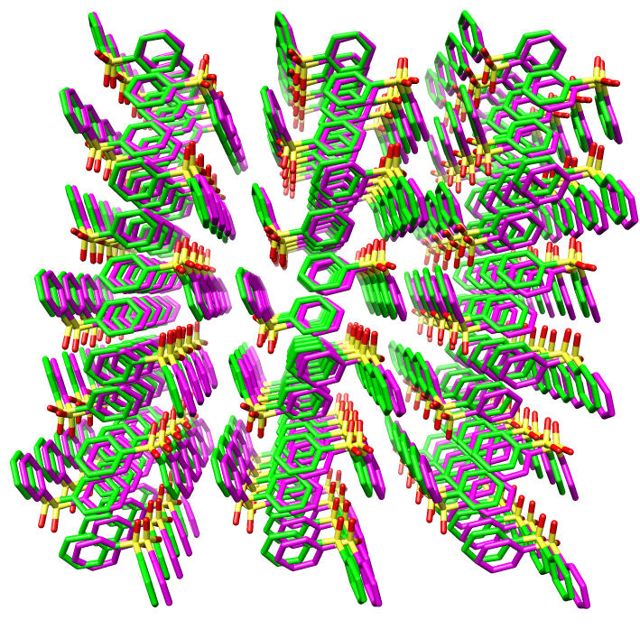
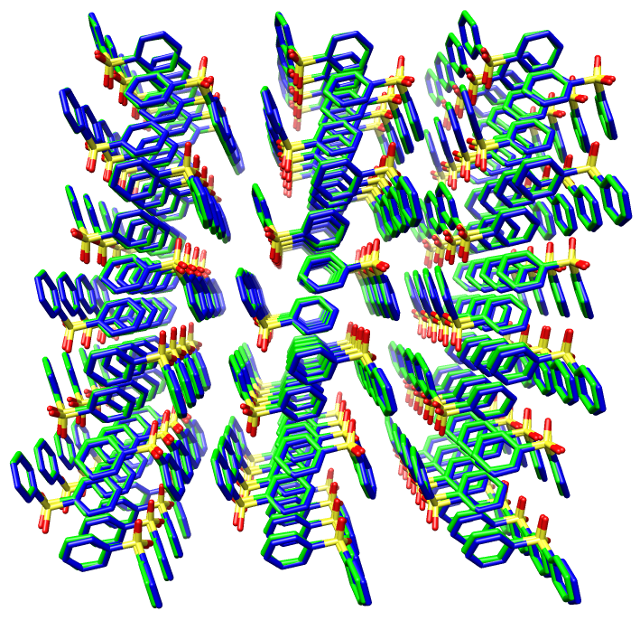

Below an example workflow for an optimization of Lennard jones parameters for diphenyl-sulfone is provided
All input and output files are provided in the examples folder.

1. Starting with a crystal structure (usually a cif file from the [CCDC](https://www.ccdc.cam.ac.uk/),
here dps.cif) generate a super-cell (multiples of the unit cell in 3 dimensions) of a size that ensures that
no atom is closer than twice the Lennard Jones cut-off paramter (usually 1-1.2 Angstrom) plus a small
buffer of at least one Angstrom, to any of is periodic replicas. Here this requires a supercell comprising
3x4x3 unit cells. We use chimera (after converting the cif to PDB format), or gdis for this purpose. Save
the super cell in PDB format, Here this file is called dps-01.pdb Make sure that each of the molecules in
the structure file has canonical atom ordering (openbabel can be used for this purpose)
If more than on crystal structure is used for paramter optimization, provide one pdb file for each
(named dps-01.mdp, dps-02,mdp, etc).

2. Extract one of the molecules in dps-01.pdb, save as PDB file (dps.pdb), convert to mol2
format (dps.mol2, e.g., with openbabel),
```
obabel dps.pdb -Odps.mol2
```
and replace the partial charges in the mol2 file by ESPD charges. Here we generally use
AM1BCC, RESP, or ABC2G charges (see [Ambertools](http://ambermd.org/AmberTools.php).

3. To generate a Gromacs topology input file for the molecule with GAFF2 parameters, we use acpype, 
as in:
```
acpype -i dps.mol2 -c user -a gaff2
```
This should create a number of files including dps_GMX.itp which contains force field
parameters based on the GAFF2 parameter set, including initial values for LJ parameters for the molecule
in Gromacs topology format. Split dps_GMX.itp into two files, one containing the atomtypes
section, the other the moleculetype section (save as atomtypes.atp and moleculetypes.itp)
In the atomtypes.atp file, in each line for a given atom type that you want to optimize, add
a semi-colon follwed by the number 1, for atomtypes whose paramters you want to remain frozen
add 0 instead of 1.

4. Next to the files discussed above (dps-01.pdb, atomtypes.atp, moleculetypes.itp) we require
a few more input files (0, 1.ndx, 4abc, 4ndx) which are simple text files use as STDIN when
using gromacs tools to post-process output files. These can generally be used unmodified,
and are provided in the examples folder. One more input file is here called md01.mdp.
This is the parameter input file for the exoernal Gromacs runs. THe only parameter that
needs to be adjusted in this file is the temperature (ref-t), which should be set to the
temperature used in the crystal structure determinaton. If more than on crystal structure
is used as input, provide one mdp file for each (named md01.mdp, md02,mdp, etc).

5. Edit the fomx parameter input file dps.inp. Here this file reads:
```
n_xtalpdbs   1
MDtimeout    300
MCcycles     1000
thrRMSD      0.05
thrDLAT      1.0
```
This is a simple textfile, each line has the fomat:
```
parameter-name value
```
n_xtalpdbs is the number of crystal structures used, MDtimeout is the wall-time (in seconds) that
a single MD simulation in Gromacs is allowed to run. This is useful as sometimes (in very rare cases)
the MD hangs, and needs to be killed, followed by a change of parameters.
MCcycles is the maximum number of Monte Carlo cycles to be run. For molecules as small as dps
a few hundred cycles are usually enough for convergence. For larger molecules with more LJ parameter
types a higher number might be required. thrRMSD and thrDLAT are thresholds for the RMSD between the
average simulated and the experimental/input structures (in nm), and for the maximum difference between
any of the six lattice parameters and its experimental counterpart (in percent).
The parameter used here to estimate the simularity between simulated and experimental structures
is dtot = sqrt((RMSD/thrRMSD)^2+(DLAT/thrDLAT)^2). If the fitted LJ parameters result in a simulated
structure that deviations from the experimental structure by less than a given dtot, the run is considered
converged and terminated, otherwise the run terminates after MCcycles cycles.

6) Start the run:
```
fomc -i dps -s 21691 -n 1 -r fomc-dps -a atomtypes.atp > fomc-dps.out 2>&1

```
depending on your hardware the runs require between seconds and minutes per cylce.

7) Collect the output. In our example the run converges after 197 cycles, and the final
topology with optimized LJ parameters is saved in a file called best-fomc-dps-21691.top.
e used the resulting parameter set (GAFF2 intra-molecular FF parameters + ABC2G charges + optimized
LJ parameters), performed a longer (a few nano seconds seconds) MD simulation, and compared
the average structure from this simulaton to the results obtained with the original (all GAFF2)
parameters. The comparisons between the experimental crystal struture (in green) and the results
with the two parameter sets (optimized: blue, GAFF2 purple) is shown in the Figure blow.



